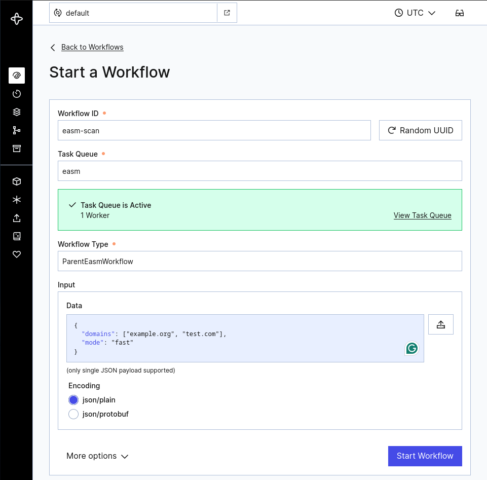
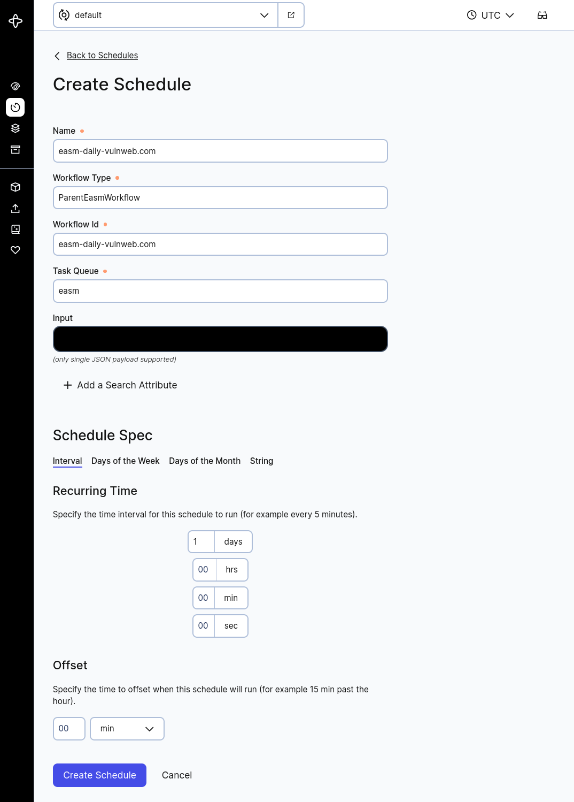
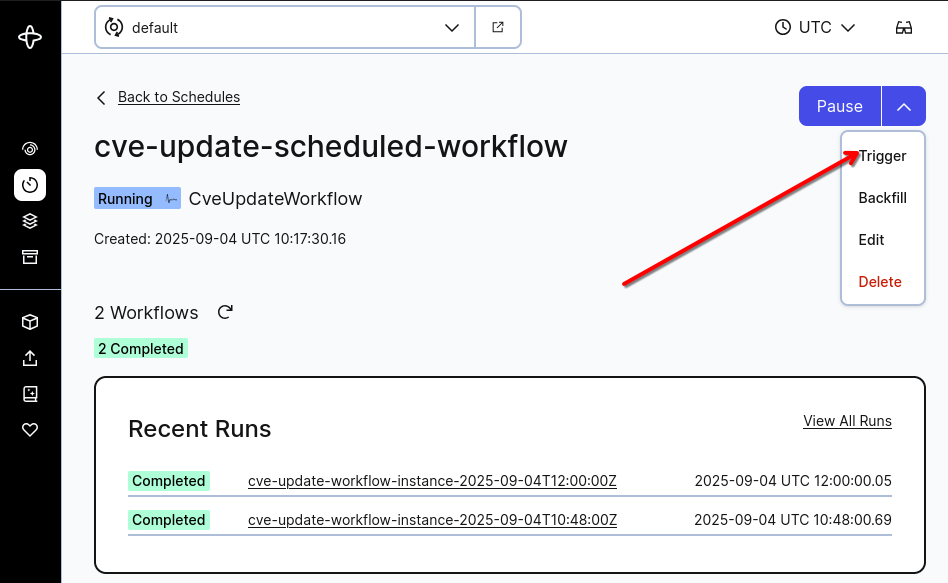

# Cyber Attack Surface Management (CASM)

This repository contains the CASM component that contains several workflows - external attack surface scanning using
EasyEASM, internal attack surface scanning using Nmap, topology scanning using Nmap, and CVE connector, 
in its current version.

The environment consists of the following components:
* Neo4J database for results
* Custom Temporal worker carrying out the workflows
* Redis as an in memory database for EasyEASM worker to pass the scan results between tasks
* PostgreSQL database utilized by scanning tool
* Workers for individual workflows
* Other containers providing functionality to workers

The demonstrator can be deployed with Docker. There is a `compose.yml` file spawning all components.
This component has a dependency on two other components - workflow orchestrator that orchestrates the workflows
and ISIM that contains a Neo4j database. 

# Configuration
Configuration files are located in the [config](config) and in [docker](docker) folders. Config in [config](config) serves for local deployment of workers
and for running clients to trigger on-demand workflows. 

Configs in [docker](docker) folder are used by dockerized app where urls and paths are preconfigured to work within the docker environment:
- config.yaml: config for workers, same format as in the local deployment
- amass_config.yaml: config file for worker, configures amass to know where is the postgresql located

The configuration is rather simple, it contains the following:

```yaml
temporal:
  url: "temporal:7233"
  namespace: default
  easm_task_queue: easm
  nmap_task_queue: nmap
  cve_connector_task_queue: cve_connector

neo4j:
  password: supertestovaciheslo
  bolt: bolt://neo4j:7687
  user: neo4j

redis:
  host: redis
  port: 6379

isim:
  url: "http://isim:8000"

nmap_basic:
  targets:
    - metasploitable3
  arguments: "-sV -A"

nmap_topology:
  targets:
    - metasploitable3
  arguments: "-sn -n --traceroute"

easm_scanner:
  domains:
    - vulnweb.com
  mode: fast  # fast or complete
  httpx_path: "/app/go/bin/httpx"
  threads: 100   # required only for complete mode
  wordlist_path: "/app/temporal/easm/subdomainwordlist.txt"  # required only for complete mode

slp_enrichment:
  x_api_key: ""

cve_connector:
  nvd_api_key: ""
```
- temporal:
  - url: url of Temporal server GRPC service from the [workflow orchestrator repository](https://github.com/resilmesh2/Workflow-Orchestrator/)
  - namespace: namespace on Temporal server
  - task_queues: task_queues used by Workers and Workflows
- neo4j:
  - password: password for Neo4j user
  - bolt: url of Neo4j instance
  - user: Neo4j user username
- redis:
  - host: url of Redis
  - port: port where Redis listens
- isim:
  - url: url of ISIM server
- nmap_basic:
  - targets: list of targets to scan
  - arguments: arguments passed to nmap
- nmap_topology:
  - targets: list of targets to scan
  - arguments: arguments passed to nmap
- easm_scanner:
  - domains: list of domains to scan
  - mode: fast or complete
  - httpx_path: path to httpx binary
  - wordlist_path (required only for `complete` mode): path to wordlist for dnsx, default is placed in `temporal/easm/subdomainwordlist.txt`
  - threads (required only for `complete` mode): number of threads for dnsx bruteforce
- slp_enrichment:
  - x_api_key: API key for Silent Push Explore API at https://api.silentpush.com/api/v1/merge-api/ that can be obtained 
  from [their website](https://app.silentpush.com/) as documented in [documentation](https://docs.silentpush.com/).
- cve_connector:
  - nvd_api_key: key for NVD REST API. Instructions for obtaining the key are listed in [README](cve_connector/README.md).

When deploying CASM in an environment where endpoints for `temporal`, `neo4j`, and `redis` are not
accessible using localhost, you should use names of containers instead of localhost. Names of containers
can be found from list of containers using, e.g., `docker container ls -a`. Please, ensure that your config is filled
with values instead of empty strings when deploying CASM.
If you encounter some problems
with CASM, you can also try to enter configuration details in `config.py`, which contains data classes
that store the configuration details.

# How to Run

## Prerequisites

CASM requires Neo4j database to be set up and running. It is recommended to run [ISIM](https://github.com/resilmesh2/ISIM) first (e.g., in Docker).
Another prerequisite is the [workflow orchestrator](https://github.com/resilmesh2/Workflow-Orchestrator/) that must be up using its compose.yml file. Afterwards, CASM can 
be deployed using Docker.

## Running the app

After running:
```
docker compose up -d
```
you can verify that the following is available:

### Neo4J database
Neo4J should be available at http://localhost:7474/browser/. The default credentials are `neo4j:supertestovaciheslo`. If you want to change the credentials you can do so in the `compose` file by chaging the `NEO4J_AUTH` variable. Please, do no forget to pass the new credentials to the Temporal worker configuration as well (see [Configuration](#configuration))

### Temporalio server
Temporalio server from the [workflow orchestrator](https://github.com/resilmesh2/Workflow-Orchestrator/)
should be available at http://localhost:8080/. You can watch the progress 
of your workflows there, or look for errors if any problems occur. 
You can also create a scheduled scanning workflow there.

### Worker
Worker is a custom image build by this [project](Dockerfile) for EasyEASM. Worker has installed:
- Python 3.12: workflow is implemented in Python 3.12
- Go 1.23.1: necessary for scanning tools
- [EasyEASM](https://github.com/g0ldencybersec/EasyEASM) - the main scanning tool triggered on worker by workflow with the following prerequisited installed in image as well:
  - alterx@latest
  - amass@master: fixed at V3 version (available also as V4)
  - dnsx@latest
  - httpx@v1.6.0: important! Different versions of httpx can lead to wildly different results and can break this demonstrator
  - oam_subs@master
  - subfinder@latest

You can rebuild this worker by running:
```
  docker compose up -d --build
```

### Other workers
There should also be workers for Nmap and CVE connector available in your list of containers.

## Triggering workflow (EasyEASM)

> [!WARNING]
> Be aware that the point of this project is to run scans against live domain names. This means that you should select your
> targets **VERY** carefully. Generally, it is advised against running the workflow against random targets available on the Internet.
> 
> The workflow was tested against _vulnweb.com_ domain name very cautiously. The target was selected because it 
> hosts intentionally vulnerable web applications and is made for testing purposes.

This project provides user with a prepared client that can connect to Temporal and trigger workflow on selected targets. If you want
to run this client, you need to do the following:

### Dependencies
This project utilizes Poetry. It is necessary to have Python 3.12 installed together with poetry. To create the venv and install all
dependencies, run:
```
poetry install
```

If you would like to run the scan from docker container called `worker`, you just need to connect to its terminal using
```bash
sudo docker exec -u 0 -it <container_id> bash
```
This command connects to the container as the root user because of `-u 0`. If you need to modify some files,
you can install, e.g., nano using `apt update` and `apt install micro`.

### Running the easm scan
To change the scan parameters, you can modify the [config.yaml](docker/config.yaml).

You can replace the `domains` in config with your own target domains.

To trigger the workflow, run the following command inside the container:
```sh
python -m temporal.easm.parent_workflow
```

### Verifying results
If you triggered a workflow and want to see if it succesfully finished, you can:

1) Check the workflow status in Temporal server via GUI
2) Run Cypher queries on Neo4J to look up the results

This is an example of a NEO4J query fetching all IP addresses and their resolution to domain names.
```cypher
MATCH (ip:IP)-[:RESOLVES_TO]-(d:DomainName) RETURN ip,d
```

### Setting up a single workflow
You can create a single workflow using Temporal GUI. Click on `Start Workflow` inside of the panel for workflows.
Use arbitrary workflow ID, `easm` as the Task Queue,
and `ParentEasmWorkflow` as the Workflow Type.

By default, the workflow parameters are taken from [config.yaml](docker/config.yaml). However, if you want to run a 
workflow with a different configuration than what was configured when the temporal worker started, you can provide a 
custom configuration in the input field of the workflow. The input should be in JSON format matching the structure of 
the `easm_scanner` section from [config.yaml](docker/config.yaml).

For example, to run an EASM scan with different domains:
#### Fast Mode (recommended)
```json
{
  "domains": ["example.org", "test.com"],
  "mode": "fast"
}
```

#### Complete Mode
```json
{
  "domains": ["example.org", "test.com"],
  "mode": "complete",
  "threads": 50,
  "wordlist_path": "/app/temporal/easm/subdomainwordlist.txt"
}
```

The correct settings are visualized in the following figure.



The same applies to other workflows as well (e.g., `NmapBasicWorkflow` and `NmapTopologyWorkflow`).

### Setting up scheduled workflow
You can create periodic scheduled scans via Temporal GUI. When you create such a workflow, it calls the same workflow, 
which is called in  



## Triggering a workflow (SLP Enrichment)

This workflow can be triggered by executing:

```shell
sudo docker exec -it <slp_worker_container_id> python -m temporal.slp_enrichment.workflow
```

After executing the command, you can find a new workflow in Temporal UI. Results from a successful workflow
can be found in the Neo4j database. The new information can be found among IP addresses, domain names, 
and subnets.

# CVE connector
Instructions for running the CVE connector are listed in [README](cve_connector/README.md).
The most important thing is to obtain NVD REST API key that should be used by the CVE connector.

## Nmap and CVE connector DEMO
For this demo, we have prepared a `metasploitable3` container in compose.yml, which you need to uncomment. 
If you wish to use a different target, you can change nmap targets in [docker configuration file](#configuration).
Then you can start the CASM application with the following command inside the project root directory: 

```bash
docker compose up -d
```

Then, build and start the ISIM application similarly and ensure the `external: true` is uncommented in the `resilmesh_network` network.
When everything is up and running, you can run the nmap demo by running:

```bash
docker exec -it nmap-worker python -m temporal.nmap.topology.workflow && docker exec -it nmap-worker python -m temporal.nmap.basic.workflow
```

You can check the workflow progress in the Temporal server GUI http://localhost:8080/namespaces/default/workflows.
When the nmap workflows finish successfully, you can check the populated Neo4j database on http://localhost:7474/browser/.

Then either wait for the cve-connector scheduled workflow to trigger, or trigger it manually  by going here: 
http://localhost:8080/namespaces/default/schedules, click on the cve-update-scheduled-workflow and in the right upper 
corner select `Trigger`. 



You can leave the first `Use Policy` option and click `Trigger`.


Again, you can check the workflow progress in the Temporal server GUI http://localhost:8080/namespaces/default/workflows.
When the cve-connector workflow finishes successfully, you can check the populated neo4j database on http://localhost:7474/browser/

# Tests
Tests are available in `test` folder. 
Test data contain an example output that can be obtained from scanning by EasyEASM.

# Versions Used During Testing
CASM was successfully tested with the following OS configuration and docker versions. 
Versions of software packages can be found in `poetry.lock` and `pyproject.toml` files.
These versions of software packages are automatically deployed when docker is used according to 
instructions from this README.md file.

|Operating System|Docker Version|Docker Compose Version| Memory   |CPU Architecture|Number of Cores|
|----------------|--------------|----------------------|----------|----------------|---------------|
|Ubuntu 24.04.2 LTS|28.0.4|v2.34.0| 32.0 GiB |x86_64|16 cores|
|Ubuntu 24.04.1 LTS|26.1.3|v2.14.0| 32.0 GiB |x86_64|6 cores|
|Ubuntu 22.04.5 LTS|28.0.4|v2.34.0| 64.0 GiB |x86_64|16 cores|